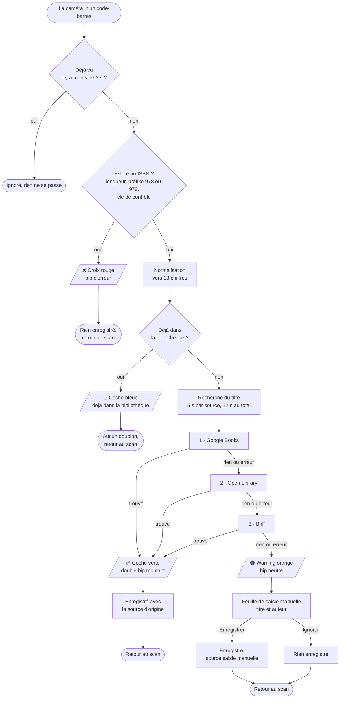

# Le parcours d'un livre, du code-barres à la fiche

Ce document décrit ce que fait réellement l'application entre le moment où la caméra
lit un code-barres et le moment où le livre est (ou n'est pas) enregistré. Il est écrit
sans vocabulaire technique : c'est la référence contre laquelle vérifier le comportement
observé sur le téléphone.

Pour savoir *où* est le code correspondant, voir [`CLAUDE.md`](../CLAUDE.md).

## Vue d'ensemble

## Étape par étape

### 1. La caméra lit en continu

Elle analyse toujours l'image la plus récente et jette le retard accumulé. C'est ce qui
permet d'enchaîner les livres sans latence perçue : on ne traite jamais une image
vieille de deux secondes.

Elle accepte volontairement bien plus que les codes de livres (EAN-8, Code 128, QR…).
Si on passe une boîte de conserve devant l'objectif, il vaut mieux qu'elle réponde
« ce n'est pas un livre » plutôt que de rester muette et de laisser croire à un problème
de mise au point.

### 2. Filtre anti-répétition

Un même code relu dans les 3 secondes est ignoré, et rien de nouveau n'est traité tant
qu'une recherche est en cours. Sans cela, un livre qui traîne devant l'objectif
déclencherait dix fois le même travail.

> ⚠️ Ce filtre a une limite connue, voir [« Limite connue »](#limite-connue) plus bas.

### 3. « Est-ce vraiment un ISBN ? »

Trois vérifications, dans l'ordre :

- **la longueur** — 13 caractères, ou 10 pour les anciens ISBN ;
- **le préfixe** — les livres vivent dans les plages `978` et `979` ; un code de produit
  alimentaire commence par autre chose et se fait refuser ;
- **la clé de contrôle** — un ISBN contient un chiffre calculé à partir de tous les
  autres. Un code mal lu se trahit donc tout seul, sans aucun appel réseau.

Deux cas particuliers méritent d'être connus :

| Cas | Traitement |
|---|---|
| Code commençant par `9790` | C'est une **partition de musique** (ISMN), pas un livre → refusé |
| Ancien ISBN à 10 chiffres | Converti vers la forme moderne à 13 chiffres |

Cette conversion compte : elle garantit qu'un même livre scanné sous l'une ou l'autre
forme soit reconnu comme le même ouvrage.

### 4. « Je l'ai déjà ? »

Regard dans la bibliothèque locale. Si le livre y est déjà → coche bleue, aucun doublon
créé, retour immédiat au scan.

Ce cas devient vite le plus fréquent quand on inventorie une étagère entière, et c'est
précisément pour ça qu'il existe : un doublon silencieux serait pire qu'un retour
explicite.

### 5. La recherche du titre

Trois catalogues sont interrogés **l'un après l'autre**, en s'arrêtant au premier qui
répond quelque chose d'exploitable :

| Ordre | Catalogue | Pourquoi à cette place |
|---|---|---|
| 1 | Google Books | Le plus rapide et le plus large |
| 2 | Open Library | Bonne couverture anglophone, complète le premier |
| 3 | BnF | Plus lent, mais rattrape la plupart des livres français que les deux autres ignorent |

Chaque catalogue dispose de 5 secondes, l'ensemble de 12 secondes au maximum. Un
catalogue en panne, injoignable, ou qui répond n'importe quoi est simplement traité
comme « pas de réponse » : on passe au suivant. Aucune erreur n'est affichée, rien ne
bloque.

Pendant cette attente, un petit indicateur discret tourne dans un coin — jamais de
fenêtre modale qui interromprait le geste.

### 6. L'issue

| Issue | Retour | Suite |
|---|---|---|
| Trouvé | ✅ coche verte, double bip montant | Enregistré avec la mention du catalogue d'origine |
| Introuvable partout | 🟠 warning orange, bip neutre | **Seul cas qui interrompt** : saisie manuelle du titre et de l'auteur, ou abandon du livre |
| Pas un ISBN | ❌ croix rouge, bip d'erreur | Rien n'est enregistré |
| Déjà présent | 🔵 coche bleue, double bip court | Aucun doublon |

Hors saisie manuelle, l'icône s'affiche environ 0,8 seconde puis s'efface seule. **Elle
ne bloque rien** : la caméra n'a jamais cessé de lire, on peut présenter le livre suivant
pendant que l'icône est encore à l'écran.

L'icône est toujours affichée, indépendamment du volume du téléphone : c'est elle le
canal principal, le son n'est qu'un bonus.

### 7. Après le scan

L'écran Bibliothèque lit directement la base, donc un livre scanné y apparaît sans
qu'aucun rafraîchissement soit nécessaire. De là on peut chercher (sans se soucier des
accents ni de la casse), trier, corriger une fiche, supprimer avec un « Annuler », et
exporter l'ensemble en JSON.

Une correction manuelle bascule la fiche sur la source « saisie manuelle », pour que la
provenance affichée reste honnête.

## Ce qui sort du téléphone

**L'image ne quitte jamais l'appareil.** Le décodage du code-barres se fait sur place.
La seule donnée envoyée aux trois catalogues est le numéro ISBN. Pas de compte, pas de
serveur intermédiaire, pas de clé d'API.

## Limite connue

Le filtre anti-répétition de l'étape 2 démarre **à la détection du code**, alors que la
recherche réseau qui suit peut durer plusieurs secondes. Quand l'enregistrement se
termine, la fenêtre est donc déjà consommée — et le livre, encore dans le champ, est
relu aussitôt : on voit une coche verte suivie d'une coche bleue.

Correction suivie dans
[l'issue #1](https://github.com/bcolombani/bibli/issues/1) : faire courir la fenêtre à
partir de la **fin** du traitement, et la porter à 5 secondes.
